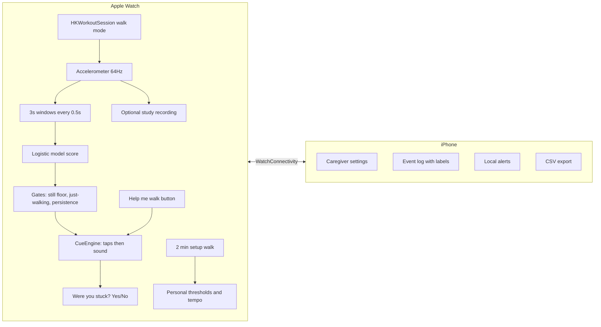

# Product plan: Walking Beat (Apple Watch + iPhone)

Citations like [n] point to [REFERENCES.md](REFERENCES.md). The evidence is in [RESEARCH.md](RESEARCH.md).

## 1. What makes this not a gimmick

A gimmick promises automatic detection and hides how often it is wrong. This product rests on
three commitments:

1. **The intervention works without the detector.** The watch's "Help me walk" button gives an
   evidence-based rhythmic cue [6-10] instantly, with no false positives. Even with detection
   switched off, the product delivers the "permanent cueing device" the RESCUE authors called
   for [6].
2. **Detection is measured honestly and switched on conservatively.** We report event-level false
   alarms per hour for patients the model has never seen (nested leave-one-subject-out), not
   in-sample accuracy. Current numbers are modest (see RESEARCH.md section 4), and the plan is
   built around improving them with real wrist data.
3. **False alarms are made cheap.** The first seconds of every automatic cue are discreet wrist
   taps. Sound follows only if the freeze continues. The cue stops by itself when walking
   resumes, and one tap stops it. Nobody else notices a false alarm.

## 2. Users and jobs

| User | Job to be done | What they touch |
|---|---|---|
| Person with PD and FoG (often 65+, may have tremor, low vision, mild cognitive changes) | "When I get stuck, help me get moving again without fuss." | Watch only: one big Start button, one big Help button, one big Stop button, a Yes/No question after a cue |
| Caregiver / family member | "Set it up once, know it's working, and see how often freezes happen." | Phone: setup wizard, tempo, cue type, sensitivity, alerts, log, export |
| Physiotherapist / neurologist | "Objective freeze data between visits; a cueing tool I can prescribe." | CSV export now; clinician dashboard later |

## 3. What is built (v0.1, this repository)

- **Shared tested core.** `Packages/FoGCore` (detection, calibration) and `FoGKit` (settings,
  events, cue scheduling, summaries) are platform-independent Swift. 22 unit tests run on Linux or
  macOS, including parity tests that replay real patient data and require Swift output to match
  the Python reference.
- **Research pipeline.** `research/` downloads Daphnet, extracts features, trains the model, runs
  nested leave-one-subject-out evaluation, and exports `detector_profiles.json` plus the golden
  fixtures.
- **Watch app.** Walk mode (runs as a workout that is never saved), detection, haptic plus
  audio metronome (click, soft drum, or spoken count), manual Help, a Yes/No label after each
  automatic cue, a guided setup walk that measures cadence with `CMPedometer` and personalises
  thresholds, and study recording.
- **Phone app.** A 3-step onboarding with an explicit limitations screen; a Today summary;
  an event log with Real freeze / Not needed labels; CSV export "for doctor"; settings (tempo
  with a hear-and-feel preview, cue mode, sound, sensitivity, alerts, study recording).
- **Deliberately out of scope for the demo:** accounts and auth, cloud sync, remote caregiver
  alerts (these need a backend and push), fall detection, and clinician web dashboard.

## 4. False-alarm strategy (defense in depth)

| Layer | Mechanism | Guards against |
|---|---|---|
| Scope | Detection runs only in walk mode | Cues during TV, meals, sleep |
| Context gate | Sustained walking must have ended at most 5 s earlier (default profile) | Sitting, gesturing, eating, tremor at rest |
| Stillness floor | Minimum movement energy | Quiet standing (Moore: standing was the main false-positive source [11]) |
| Evidence | Model probability >= 0.9 | Normal gait variability |
| Persistence | Holds for 3-4 s, one dropout allowed | Brief pauses, one-off windows |
| Personal threshold | Setup walk puts the threshold above the person's own normal-walking scores (never lowers it) | Unusual individual gait [11] |
| Refractory | 3 s after each cue | Repeated retriggering |
| Low-cost cue | Taps for the first 4 s, sound after | Embarrassment from false alarms |
| Feedback | Yes/No after every automatic cue, labels in the log | Silent drift; creates retraining data |

## 5. Roadmap

Each phase has a measurable exit criterion. Phases are described by technical scope, not time.

| Phase | Scope | Exit criterion |
|---|---|---|
| **0. Demo (done)** | Everything in section 3 | Tests green; builds in Xcode; runs on a paired watch and phone |
| **1. Device verification** | On-device checks that simulators cannot cover: background haptics and audio during a workout session with the wrist down, audio routing to watch speaker vs AirPods, sample-rate stability at 64 Hz, battery drain per hour of walk mode | Cue fires within 1 s of confirmation with the screen off; battery drain <= 10%/h |
| **2. Supervised wrist study** (see VALIDATION.md) | 15-20 people with FoG do a FoG-provoking protocol on video, wearing the watch in study-recording mode plus a phone in the pocket | Labeled wrist dataset; wrist nested-LOSO numbers published |
| **3. Personal model** | Retrain on-watch or on-phone from each user's Yes/No labels; optional gyroscope features; optional phone-in-pocket as a second sensor, where both must agree | For the median user: <= 1 false alarm per 2 hours of walk mode, and >= 50% of freezes >= 5 s cued |
| **4. Home pilot** | 4-week at-home use with caregivers; remote caregiver alerts (backend plus push); clinician export | Weekly active use >= 60% of participants; SUS usability score >= 70; caregivers would recommend it |
| **5. Regulatory** | Quality management system (ISO 13485), risk file (ISO 14971), software lifecycle (IEC 62304), clinical evaluation | Pre-submission meeting with FDA / notified body |

## 6. Risks and mitigations

| Risk | Impact | Mitigation |
|---|---|---|
| Wrist detection too weak | Core promise of "automatic" fails | The Help button carries the value; phase 2 data; phone-in-pocket (matches the thigh data the model was trained on) and a belt clip (trunk: 0.45 false alarms/h in our evaluation) as optional sensors |
| False alarms annoy users, who abandon the app | Churn | Section 4; default profile is the most conservative; each false alarm costs only a few taps |
| Missed freezes create false reassurance | Safety | Onboarding and About screens state that it misses freezes; no fall-safety claims |
| watchOS limits (background, audio routing, battery) | Cue not delivered | Phase 1 device verification; haptics are the primary cue channel |
| Regulatory | Selling blocked | Disease-specific detection and cueing is very likely a medical device (general wellness excludes disease-mitigation claims [20]); precedent of an Apple Watch PD device via 510(k) [19]; run pilots as research under ethics approval |
| Competition (CUE1+ sternum device [17], Path Finder laser shoes [18]) | Differentiation | They need dedicated hardware. We run on a watch people already wear, combine on-demand and automatic cueing, and produce a freeze log for clinicians |

## 7. Regulatory stance (not legal advice)

The FDA general wellness policy excludes products that make claims about diagnosing or mitigating
a disease, or that prompt specific clinical action [20]. Detecting FoG and cueing to relieve it is
such a claim, so the realistic route is a medical device path. In the US that means 510(k) with a
predicate, or De Novo; NeuroRPM [19] shows Apple Watch PD software can be cleared. In the EU, MDR
Rule 11 would likely make it Class IIa. Until then: research use under ethics approval, no claims
in marketing, and the disclaimers shown in the app. Get regulatory counsel before any public launch.
